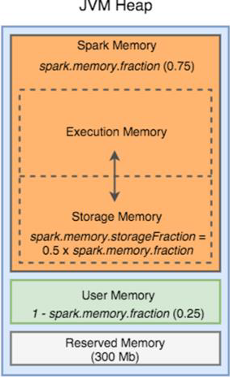

# What is Spark?

- Spark is a fast in-memory data-processing engine.
- Ability to efficiently execute streaming, machine learning or SQL workloads which require fast iterative access to data sets.
- Can run on top of Apache Hadoop YARN, Mesos & Kubernetes
- It can cache data set in memory and speed up iterative data processing. Is  ~100 folds faster than MR, in benchmark tests. The speed up is direct benefit of write speed of RAM over HDD. For example given *x* TB of data and say *n* nodes, to process the data if MR takes 2/3 days, Hive with Tez will take 4/5 hours, whereas Spark will take 20/30 minutes.
- Spark facilitates Custom code, SQL, Realtime streaming, ML, etc. It is called the Swiss Army knife of Data World.

# Hadoop Map Reduce Limitations

Here by MapReduce, we mean MapReduce and associated technologies like Hive. 

- Hive / MapReduce is based on disk based computing.
- Suitable for single pass computations, not iterative computations. Needs a sequence of MR jobs to run iterative tasks.
- Needs integration with several other frameworks / tools to solve Big data use cases. Such as Apache Storm for stream data processing, Mahout for ML, etc.

If using distros like Cloudera, MapR, HDInsight, etc. people prefer Hive. If using distributions like Databricks, EMR, Dataproc, etc  people use spark.

These days MR / Hive are only used for maintaining old code bases. Hive is used only in situations where DW kind of job requirements and also since SQL developers are readily available. Slowly all these jobs are being migrated to Spark.

# Spark vs MR Performance

- Spark processes data in memory, while MR persist back to disk after a MapReduce Job. So spark outperforms MR.
- Nonetheless, spark needs a lot of memory. If data is too big to fit in memory, then there will be major performance degradation for Spark.
- MR kills its job as soon as it's done, So it can run alongside other services with minor performance differences.
- Till Spark has an advantage as long as we are  talking about iterative operations on data.

# Spark Components

- **Spark Core,RDD, DF, DS, SQL** - API’s for basic data processing needs for batch layer.
- **Spark Streaming** - API for real time processing needs for speed layer of data pipeline.
- **Spark MLLib** - API for Machine learning processing needs.
- **Graph X** -  API for needs of complex processing of Graph based data models with nodes and interactions between them.


# RDD (Resilient Distributed Dataset)

RDD is the primary abstraction in Spark and it is the core of Apache spark. RDD are **immutable** and **partitioned** collection of records. RDDs **can only be created by** reading data from a stable storage like HDFS or by transforming on existing RDDs.

**Resilient**, fault tolerant with the help of RDD lineage graph and so able to recompute missing or damaged partitions due to node failures. **Distributed** with data residing on multiple nodes in a cluster. **Dataset** is a collection of partitioned data with primitive values or values of values, e.g. tuples or other objects.

For iterative distributed computing, it’s common to reuse and share data among multiple jobs or do parallel ad hoc queries over a shared dataset. The persistent issue with data reuse or data sharing exists in distributed computing system like Map-Reduce that is, you need to store data in some intermediate stable distributed store such as HDFS or Amazon S3. This makes overall computation of jobs slower for Map Reduce as it involves multiple IO operations, replications and serializations in the process. This is where RDD is useful.


## RDDs Fault Tolerance

As RDD’s are created over a set of transformations, it logs these transformations rather than actual data. Graph of transformations to produce one RDD is called a Lineage Graph. 

In case of we lose some partition of RDD, we can replay the transformation on that partition in lineage to achieve the same computation. This is the biggest benefit of RDD , because it saves a lot of efforts in data management and replication and thus achieves faster computations.

## Traits of RDD

- **In Memory** : data inside RDD is stored in memory as much (size) and long (time) as possible

- **Immutable or Read Only** : it does not change once created and can only be transformed using transformations to new RDDs

- **Lazy evaluated** : the data inside RDD is not available or transformed until an action is executed that triggers the execution.

- **Cacheable** : you can hold all the data in a persistent “storage” like memory (default and the most preferred) or disk (the least preferred due to access speed).

- **Partitioned** : records are partitioned (split into logical partitions) and distributed across nodes in a cluster. This enables **parallel** processing. 

  **How many partitions is created (default) in RDD**?

  One important parameter for parallel collections is the number of *partitions* to cut the dataset into. Spark will run one task for each partition of the cluster. Typically you want 2-4 partitions for each CPU in your cluster. Normally, Spark tries to set the number of partitions automatically based on your cluster. However, you can also set it manually by passing it as a second parameter to `parallelize` (e.g. `sc.parallelize(data, 10)`), this creates the partitions locally at the RDD level for this RDD only. 

  `sc.defaultParallelism` will provide the default partitions at the cluster level. In Databricks it is set to 8. With less number of partitions 1, fault tolerance will not work as lineage graph cannot be created.
  
  For **repartitioning** the RDD, we can use `rddName.repartition(num_repartitions)`. If repartition happens after RDD is created will result in lot of shuffle.
  
  Shuffle happens only across nodes, so even with multiple partitions if the RDD is stored in the same node no shuffle happens.
  
- **Location Stickiness** : RDD can define placement preferences to compute partitions (as close to the records as possible).

## Creating a RDD

```python
## from a list
data = [1,2,3,4,5]
# create the RDD, [partition = 4]
rDD=sc.parallelize(data,4) # no computation occurs

## read from a file
firstRDD = spark.textFile("hdfs://…", numpartitions)

## through transformation
secondRDD = firstRDD.filter(someFunction)
thirdRDD = secondRDD.map(someFunction)
```


## RDD  Actions 

Actions are RDD operations that produce non-RDD values. They trigger execution of RDD transformations to return values. Simply put, an action evaluates the DAG.

Some of the commonly used Actions are `reduce(func), count(), show(), take(n), collect(), takeOrdered(n, [ordering])` , etc. the full list can be found [here](https://spark.apache.org/docs/latest/rdd-programming-guide.html#actions).


## RDD  Transformations

- Transformations are lazy operations on a RDD that create one or many new RDDs, e.g. map, filter, reduceByKey, join, cogroup, etc. 

- They are functions that take a RDD as the input and produce one or many RDDs as the output They do not change the input RDD (since RDDs are immutable), but always produce one or more new RDDs by applying the computations they represent. 

- Transformations are lazy,they are not executed immediately but only after calling an action are transformations executed

- After executing a transformation, the result RDD(s) will always be different from their parents and can be smaller ( e.g. filter, count, distinct, sample), bigger (e.g flatMap, union, cartesian) or the same size ( e.g. map)

Some of the common Transformations are `map(func), filter(func), distinct([numTask]), flatMap(func)`. Full list can be found [here](https://spark.apache.org/docs/latest/rdd-programming-guide.html#transformations).

# Spark Core Concepts

- Spark is built around the concepts of RDD and DAG representing transformations and dependencies between them.
- Spark Application - often referred to as Driver Program or Application Master (only when using YARN; a hive job, a MR job, a spark job all are application masters) - at high level consists of SparkContext and user code which interacts with it creating RDDs and performing a series of transformations to achieve final result.
- These transformations of RDDs are then translated into DAG and submitted to Scheduler to be executed on set of worker nodes.

# Spark Execution Workflow

<p float="left">
  
   
</p>
Spark Context (Spark Session) is the entry point of spark program. It lets interpreter know to use PySpark and not python. 

Executer is unit of Spark and container is unit of Yarn. Node Manager allocates the container an Executer.

A spark application can be broadly divided into **Driver process** and a set of **Executer processes**.

**Driver Process** consist of the User Program and the Spark session (Spark Context). It is responsible for three things: 

- maintaining information about the Spark Application; 
- responding to a user’s program or input; and analyzing, distributing, and 
- scheduling work across the executors (defined momentarily). 

The driver process is absolutely essential - it’s the heart of a Spark Application and maintains all relevant information during the lifetime of the application.

Spark session has **DAG Scheduler**, which:

- computes a DAG of stages for each job and submits them to TaskScheduler
- determines preferred locations for tasks (based on cache status or shuffle files locations) and finds minimum schedule to run the jobs. Preferred location for tasks means which Node the task will run on.

**Task scheduler** also resides within Driver and is responsible for sending tasks to the cluster, running them, retrying if there are failures,
and mitigating stragglers(slowness).

**Executer Processes**: The *executors* are responsible for actually executing the work that the driver assigns them. This means, each executor is responsible for only two things: executing code assigned to it by the driver and reporting the state of the computation, on that executor, back to the driver node.

With spark submit or spark shell we can use the property --num-executer to specify number of executers. This is the static way and not possible in Databricks. If not specified then by default will start with 1 executer. A property executer size allows for **number of executers** to dynamically scale as data size increases, ie. if executer size = 10 GB, then one executer for each 10 Gb of data.

Multiple executers help with achieving parallelism, but with many executers there will be I/O overhead as each RDD partition has to be read, written, processed in the CPU. Thus balance must be maintained between number of executers and data volume.

Each partition computation is a task.

**Cache** is used to store intermediate RDDs while doing processing (like RDD 3 above).

**Cluster Manager**: The cluster manager controls physical machines and allocates resources to Spark Applications. This can be one of several core cluster managers: Spark’s standalone cluster manager, YARN, or Mesos. This means that there can be multiple Spark Applications running on a cluster at the same time. 

**Gateway Node**: Any node used to submit Spark jobs is called gateway Node. It can either be an Edge node, Name node or Data node. Best practice is to use Edge Node.


# Spark DAG

 

DAG stands for Directed Acyclic Graph. This represents the workflow; from reading the datasource, applying transformations, to materializing the results back to the driver program. The transformations create dependencies between the RDDs, these dependencies can be narrow or wide and the transformations that causes them are classified as narrow transformation or wide transformation.

**Narrow Transformation**

- each partition of the parent RDD is used by at most one partition of the child RDD
- allow for pipelined execution on one cluster node. Pipelined execution means sequential execution.
- failure recovery is more efficient as only lost parent partitions need to be recomputed
- Example: `map, mapValues, flatMap, filter, mapPartitions, union`, etc.

**Wide Transformation**

- multiple child partitions may depend on one parent partition
- require data from all parent partitions to be available and to be shuffled across the nodes
- if some partition is lost from all the ancestors a complete recomputation is needed
- Example: `join, cogroup, groupWith, distinct, intersection, repartition, coalesce, leftOuterJoin, reduceByKey, combineByKey`, etc.

**Stages**

Spark stages are created by breaking the RDD graph at the shuffle boundaries. A job is decomposed into single / multiple stages, and stages are further divided into individual tasks.

# Spark Memory Management


**Execution Memory**

- storage for data needed during tasks execution
- shuffle related data

**Storage Memory**

- storage of cached RDDs and broadcast variables
- possible to borrow from execution memory (spill otherwise)
- safeguard value is 50% of Spark Memory when cached blocks are immune to eviction

**User Memory**

- user data structures and internal metadata in Spark
- safeguarding against OOM

**Reserved Memory**

- memory needed for running executor itself and not strictly related to Spark

# SparkContext and SparkSession

- Spark Context was used before, from spark 2 onwards SparkSession serves as the entry point to the Spark Application. In SparkContext In order to use APIs of SQL,HIVE , and Streaming , separate contexts needed to be created.

- SparkSession provides a single point of entry to interact with underlying Spark functionality and allows programming Spark with Dataframe and Dataset APIs. All the functionality available with sparkContext are also available in sparkSession. 
- In order to use APIs of SQL, HIVE, and Streaming, no need to create separate contexts as SparkSession includes all the APIs.

In Databricks, SparkSession is automatically available as *spark* variable.

```python
## creating a Sparksession
from pyspark.sql import SparkSession

spark = SparkSession.builder \
    .master("local") \
    .appName("Word Count") \
    .config("spark.some.config.option", "some-value") \
    .getOrCreate()
```

Further detailed inforamtion on creating a SparkSession and various methods available can be found [here](https://spark.apache.org/docs/latest/api/python/reference/api/pyspark.sql.SparkSession.html).

# Spark Caching

- Caching is used It is one mechanism to speed up applications that access the same RDD multiple times. An RDD that is not cached, nor checkpointed, is re evaluated again each time an action is invoked on that RDD. This can be very costly.

- There are two function calls for caching an RDD: `cache()` and `persist(level: StorageLevel)`. 

- The **difference between `cache()` and `persist()`** is : cache() will cache the RDD into memory, whereas persist(level) can cache in memory, on disk, or off heap memory according to the caching strategy specified by level. persist() without an argument is equivalent with cache(). Freeing up space from the Storage memory is performed by unpersist().

- Options for `persist()` are:

  - NONE (default)
  - DISK_ONLY
  - MEMORY_ONLY (default for cache operation for RDD’s)
  - MEMORY_AND_DISK
  - MEMORY_AND_DISK_SER

  `rdd.persist(StorageLevel.MEMORY_ONLY )` is same as `rdd.cache()`. Don’t spill to disk unless the functions that computed your datasets are expensive or they filter a large amount of the data. Otherwise, recomputing a partition may be as fast as reading it from disk.

- When SparkSession is stopped (execution is stopped), all cached RDD are unpersisted.

**When to use Caching**?

It is recommended to use caching in the following situations:

- RDD re use in iterative machine learning applications
- RDD re use in standalone Spark applications
- When RDD computation is expensive, caching can help in reducing the cost of recovery in the case one executor fails

**What happens when it is not cached** ?

Say for example in the below code:

```python
lines = sc.textFile("\path_to_file", 4)
lines.cache() # cache, donot recompute
comments = lines.filter(isComment)
print(lines.count(), comments.count())
```

W.k.t. spark creates a DAG which gets executed on call for an action. In above code count() is the action used, now when count is called on comments the DAG will also include the steps required to calculate lines. However, if caching is used only the steps after creation of line is calculated.

# Paired RDD

In Spark a Paired RDD is a key - value pair RDD, where each element is a pair tuple. It is analogous to the Map - Reduce concept. 

Ex: `rdd = sc.parallelize([(1, 2), (3, 4)])`.


```python
# reduceByKey
rdd = sc.parallelize([(1,2),(3,4),(3,6)])
rdd.reduceByKey(lambda a,b:a+b)

# sortByKey
rdd2=sc.parallelize([(1,'a'),(2,'c'),(1,'b')])
rdd2.sortByKey()

# groupByKey
rdd2=sc.parallelize([(1,'a'),(2,'c'),(1,'b')])
rdd2.groupByKey()
```

`groupByKey()` should be avoided whenever possible ; it is wide and creates shuffle of data.  Whereas, `reduceByKey()` will shuffle less data.

## `groupByKey()` v/s `reduceByKey()` v/s `aggregateByKey()` 

# Spark Shared Variables

## Broadcast Variables

In Spark RDD and DataFrame, Broadcast variables are read-only shared variables that are cached and available on all nodes  in a cluster in-order to access or use by the tasks. Instead of sending this data along with every task, spark distributes broadcast variables to the machine using efficient broadcast algorithms to reduce communication costs.

**Broadcast variables are used** in scenarios similar to when we need to send large Lookup tables to all nodes. Instead of  distributing this information along with each task over the network (overhead and time consuming), we can use the broadcast variable to cache this lookup info on each machine (worker node) and tasks use this cached info while executing the transformations. This reduces the data transfer over the network; say we have two RDDs, RDD1 = 100MB and RDD2 = 20GB and RDD2 is partitioned and distributed across nodes. Now if we want to join RDD1 and RDD2 data, it will need shuffling and will incur huge data movement across nodes. By using broadcast RDD1 can be broadcasted to every node, thus avoiding shuffle. 

When you run a PySpark RDD or DataFrame applications that have the Broadcast variables defined and used, PySpark does the following :

- PySpark breaks the job into stages that have distributed shuffling and actions are executed with in the stage.
- Later Stages are also broken into tasks
- Spark broadcasts the common data (reusable) needed by tasks within each stage.
- The broadcasted data is cache in serialized format and deserialized before executing each task.

Note that broadcast variables are not sent to executors with `sc.broadcast(variable)` call, instead they will be sent to executors when they are first used (action).

```python

import pyspark
from pyspark.sql import SparkSession

spark = SparkSession.builder.appName('SparkByExamples.com').getOrCreate()

states = {"NY":"New York", "CA":"California", "FL":"Florida"}
broadcastStates = spark.sparkContext.broadcast(states)

data = [
    	("James","Smith","USA","CA"),
        ("Michael","Rose","USA","NY"),
        ("Robert","Williams","USA","CA"),
        ("Maria","Jones","USA","FL")
]

# In case of RDD
# rdd = spark.sparkContext.parallelize(data)

columns = ["firstname","lastname","country","state"]
df = spark.createDataFrame(data = data, schema = columns)
df.printSchema()
df.show(truncate=False)

def state_convert(code):
    return broadcastStates.value[code]

result = df.rdd.map(lambda x: (x[0],x[1],x[2],state_convert(x[3]))).toDF(columns)
result.show(truncate=False)

```


## Accumulators

The PySpark Accumulator is a shared variable that is used with RDD and DataFrame to **perform sum and counter operations** similar to Map-reduce counters. These variables are shared by all executors to update and add information through aggregation or computative operations.

Accumulators are write only for Tasks at Workers, they aggregates values back from workers to Driver. Only Driver can access value of accumulator using *value* property of the accumulator variable. 

Accumulators can be used in both Actions and Transformations: In Actions each task's update is applied only once, But for Transformations it is not guaranteed (should only be used for debugging).

```python
## Example 1

accum=sc.accumulator(0)
rdd=spark.sparkContext.parallelize([1,2,3,4,5])
rdd.foreach(lambda x:accum.add(x))
print(accum.value) #Accessed by driver

## Example 2

## Counting Empty Lines
file=sc.textFile(inputFile)

# Create Accumulator[Int] initialized to 0
blankLines = sc.accumulator(0)

def extractCallSigns(line):
    global
    blankLines
    #Make the global variable accessible
    if (line==""):
	    blankLines+=1
    return line.split("")

callSigns = file.flatMap(extractCallSigns)

# Access the accumulator
print("Blank lines:%d".format(blankLines.value))
```

Some points to note..

- **sparkContext.accumulator()** is used to define accumulator variables.
- **add()** function is used to add/update a value in accumulator
- **value** property on the accumulator variable is used to retrieve the value from the accumulator.

Accumulators are used sparingly. 

## Cache vs Broadcast

Caching is used to store intermediate data (RDD), so as to avoid re-computation and facilitate Re-Use of RDDs. In broadcast also the data is cached once it is braodcasted to every node in the cluster, however in broadcast a lookup data is sent and it is cached in jevery worker node in the cluster. However in case of caching, the cache does not change/effect the distribution of a RDD. The distribution pre and post caching remain the same, ie. the RDD may be distributed across the cluster or may be stored in one node only. 

# Spark Partitions, Coalesce and Repartition


# Miscellaneous

Why use object storage services like S3?

# DF Transformations - DBR

All the below pyspark transformation functions can be found at `pyspark.sql.functions`.

- **Aggregations**
  
  - **Grouping data**
  
    - `groupBy`: groups the DF based on specified columns. returns a grouped data object in python. Ex: `df.groupBy("state", "district")`.
  
  - **Grouped data methods**: These methods  are applied only on already grouped dataframe
  
    Example: `count(), avg(), sum(), agg()`. The `agg()` method allows to use other transformations on a resulting column such as `alias()`.
  
  - **Built - in aggregate functions**: In addition to the grouped data functions that we can apply to a grouped data object, we also have a set of aggregate functions that we can import from the built in `functions` module.
  
- **Datetime**: date_format, add_months, dayofweek, from_unixtime, minute, unix_timestamp, to_date, cast("timestamp") / cast(TimestampType()), date_add.

- **Complex Types**: Built - in String and Collection functions. union, unionByName (df method), explode, array_contains, element_at, collect_set

- **Additional Functions**: Some more non - aggregate functions, DF NA Functions.

  - Non - aggreagte built - in functions: col / column, lit, isnull, rand
  - DataFrameNaFunctions: drop, fill, replace

- **User-Defined Functions**: UDF are custom transforamtion functions. This cannot be optimized by Catalyst Optimizer. The Function has to be serialized and sent to executors which also incurs overhead. Also there is overhead from Python interpreter on executers running python UDFs. These UDFs take long to run, when compared to Pandas UDF, pyspark UDFs are magnitudes slower. 

  - **create udf**: `myUdf = udf(some_python_func)` --> serializes the function and sends it to the executers to be able to use in DF.

  - **apply udf**: `myUdf(col("some_column"))`

  - **register UDF to use in SQL**: This creates the udf in the SQL namespace, so that we can apply the function usng sql code. `spark.udf.register("sql_udf", some_python_func)`.

    Example:

    ```sql
    salesDF.createOrReplaceTempView("sales")
    spark.udf.register("sql_udf", some_python_func)
    
    %sql
    SELECT sql_udf(email) as firstname from sales;
    ```

  - Use Decorator Syntax: We can also make use of decorator syntax in Python. But if we declare a UDF using decorator syntax, we will no longer be able to call the local python function.

Spark Optimization - DBR

# TODO

lineage vs DAG

how many executers

relation between rdd partitions and num executers

how many partitions

allow for pipelined execution on same cluster in narrow transformation?

which transformations cause narrow vs wide transformation? which types of transformations cause shuffle?

what is co - partitioned join?

how to know which RDD is cached in the memory?

if we create a transformation on a rdd does it change the rdd or can we reuse the same rdd for other transformations.

What is the size of braodcast variable in Spark?

is RDD column row structured?

how to checkpoint RDDs?

if first rdd is created with 80 partitions, then a transformation is apllied which reduces the size of the rdd then will the resulting rdd have same number of partitoions?

how to get size of rdds? --> https://newbedev.com/how-to-find-spark-rdd-dataframe-size

rdd cache() vs DF cache() ?

In struct type if Dataframe, what happens when one column is missing for one data file?

why is data skew a problem in Spark?
